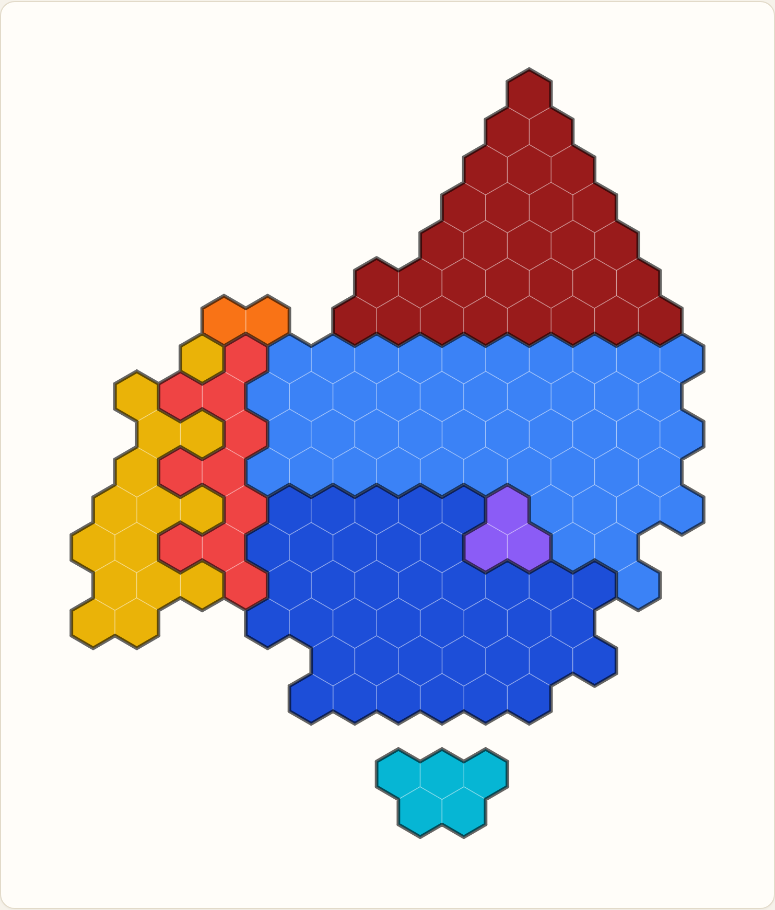
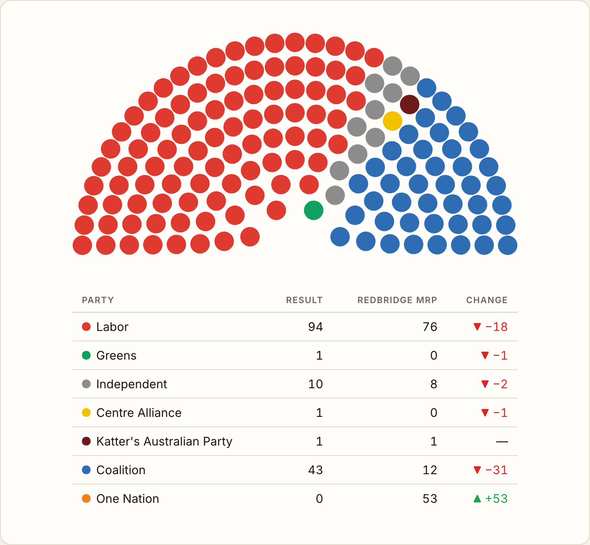
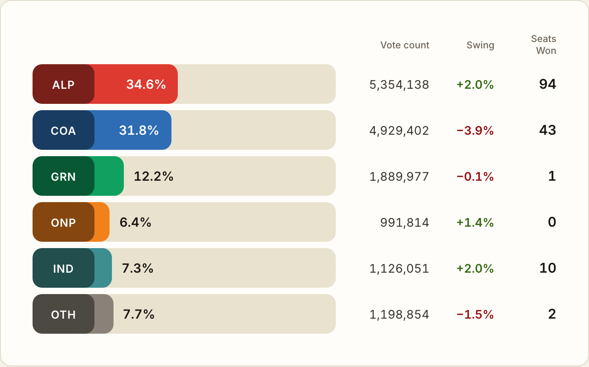
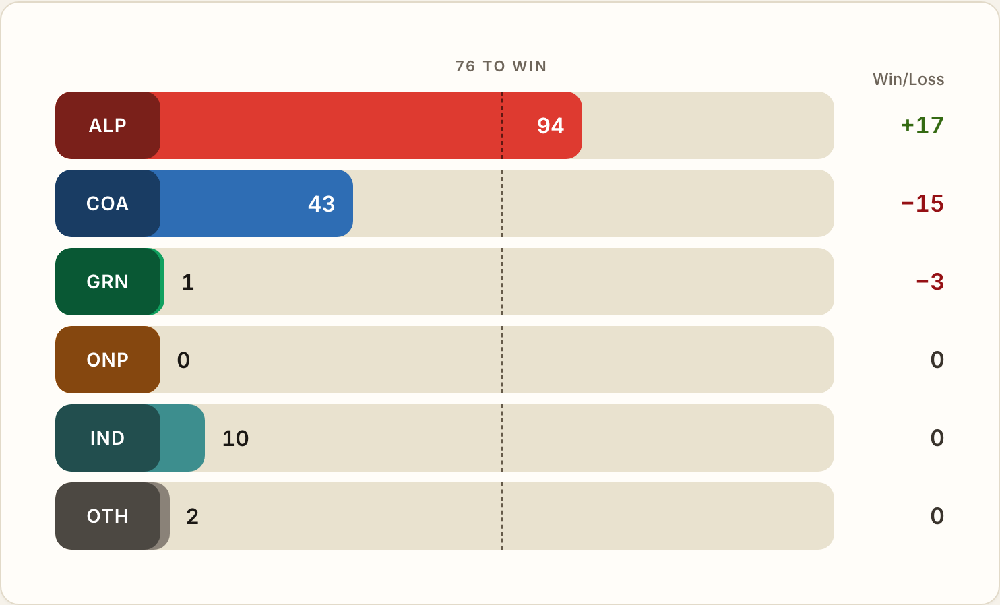
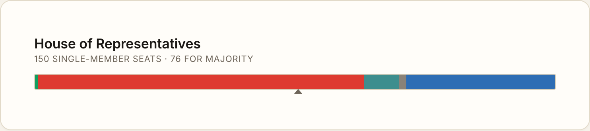
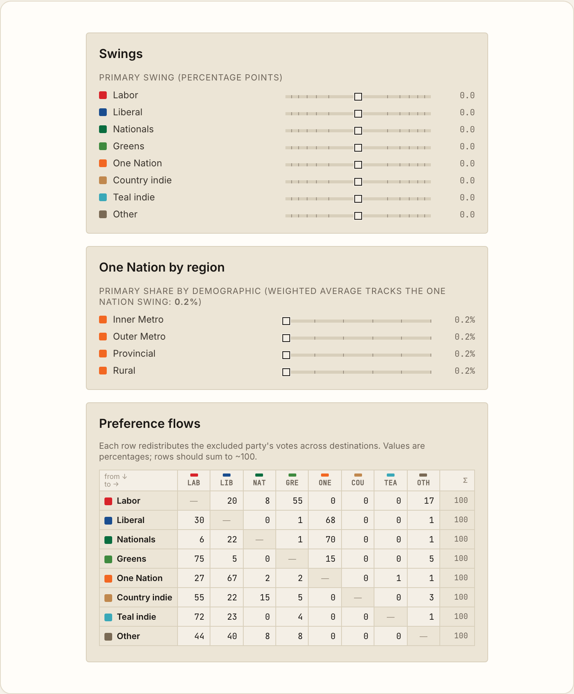

# auspoligraphs

Australian political graphs — a small library of parliament-visualisation components:
a hex cartogram, a parliament seat-dot arc, votes/seats/composition charts, and interactive
swing panels. Each component is framework-agnostic at the core (a pure layout function with no
framework dependencies) with a thin, optional React wrapper.

**▶ [Live component gallery](https://simonhac.github.io/auspoligraphs/)** — every component
rendered live, with toggles to watch them animate across the 2019, 2022 and 2025 federal results.

## Contents

- [Components](#components)
- [Install](#install)
- [Quick start (React)](#quick-start-react)
- [Quick start (vanilla JS)](#quick-start-vanilla-js)
- [Data format](#data-format)
- [API reference](#api-reference)
- [Elections](#elections)
- [Component gallery](#component-gallery)
- [License](#license)

## Components

Each widget below links to its live, interactive demo in the gallery.

### Hex cartogram

An equal-area hex map of Australia's federal House of Representatives electorates (2019, 2022,
2025). Each electorate is a single hexagon on a unified grid, giving every electorate exactly
the same visual weight — unlike geographic maps where outback electorates dwarf inner-city ones.

[Live demo →](https://simonhac.github.io/auspoligraphs/cartogram)



### Parliament arc + results table

A semicircular seat-dot composition chart for *any* parliament — pass any number of parties
(name, colour, seats), in order, and it lays them out as clean left→right wedges — alongside a
matching results/legend table with an optional change column.

[Live demo →](https://simonhac.github.io/auspoligraphs/parliament)



### Votes chart

A primary-vote bar chart with vote counts, swing, and seats won. Hover a party badge for its
full name.

[Live demo →](https://simonhac.github.io/auspoligraphs/charts/votes)



### Seats chart

A seats-won bar chart with a majority line and a win/loss column.

[Live demo →](https://simonhac.github.io/auspoligraphs/charts/seats)



### Composition bar

The whole chamber as one bar — one coloured segment per party, sized by seats, with a triangle
marking the majority threshold.

[Live demo →](https://simonhac.github.io/auspoligraphs/charts/composition)



### Swing panels

Interactive primary-swing sliders with auto/manual redistribution, a demographic-skew panel
whose weighted average tracks the One Nation swing, and an editable preference-flow matrix —
backed by the scenario engine exported from the core library.

[Live demo →](https://simonhac.github.io/auspoligraphs/controls/swings)



## Install

```bash
npm install auspoligraphs
```

## Quick start (React)

```tsx
import { FED_2025 } from "auspoligraphs";
import { Cartogram } from "auspoligraphs/react";

function App() {
  return (
    <Cartogram
      election={FED_2025}
      fill={(e) => e.state === "VIC" ? "#1D4ED8" : "#6B7280"}
      onElectorateClick={(e) => console.log(e.name)}
    />
  );
}
```

The parliament arc and its results table work for any parliament, any size:

```tsx
import { ParliamentArc, ResultsTable } from "auspoligraphs/react";

// Parties in left→right order.
const parties = [
  { name: "Labor", color: "#DE3A30", seats: 76 },
  { name: "One Nation", color: "#F08A1D", seats: 53 },
  { name: "Coalition", color: "#2B5FA5", seats: 12 },
  { name: "Independent", color: "#8C8C8C", seats: 8 },
  { name: "Katter's Australian Party", color: "#6E1A1A", seats: 1 },
];

function App() {
  return (
    <>
      <ParliamentArc parties={parties} />
      <ResultsTable parties={parties} />
    </>
  );
}
```

Prefer to do your own rendering? The pure layout function returns seat positions
for any SVG/canvas:

```javascript
import { computeArcLayout } from "auspoligraphs";

const { seats, seatRadius, viewBox } = computeArcLayout(parties);
// seats[i] = { index, row, angle, x, y, party, partyIndex }
// `index` 0 is the leftmost seat; parties form contiguous left→right wedges.
```

## Quick start (vanilla JS)

```javascript
import { FED_2022, HEX_SIZE, hexPoints, computeStateBorders } from "auspoligraphs";

const { electorates } = FED_2022; // 151 electorates

for (const e of electorates) {
  // e.name = "Kooyong", e.state = "VIC", e.col = 7, e.row = 14
  // e.px, e.py = pre-computed pixel coordinates for SVG rendering
  const points = hexPoints(e.px, e.py, HEX_SIZE);
  // → SVG polygon points string
}

// SVG path string for state boundary lines
const borderPath = computeStateBorders(electorates, HEX_SIZE);
```

Or load the raw JSON directly:

```javascript
import data from "auspoligraphs/data/elections.json";
const grid = data["2025-FED"].grid; // [[col, row, state, name], ...]
```

## Data format

All election data lives in `data/elections.json`. Each entry is a `[col, row, state, name]` tuple:

```json
[6, 13, "VIC", "Kooyong"]
```

The grid uses **pointy-top hexagons with odd-row offset**:

```
px = √3 × size × (col + 0.5 × (row & 1))
py = 1.5 × size × row
```

where `size = 14` pixels. Grid bounds: col 0–13, row 0–19.

## API reference

### Types

| Type | Description |
|------|-------------|
| `GridEntry` | Raw tuple: `[col, row, state, name]` |
| `Electorate` | Resolved object: `{ code, name, state, seatId, col, row, px, py }` |
| `ElectionMap` | Dataset: `{ electionId, label, seatCount, grid, electorates }` |
| `Party` | Input: `{ id?, name, color, seats }` |
| `ArcSeat` | Resolved seat: `{ index, row, angle, x, y, party, partyIndex }` |
| `ArcLayout` | Layout: `{ seats, rows, seatsPerRow, seatRadius, innerRadius, outerRadius, width, height, viewBox }` |
| `ArcLayoutOptions` | Tuning: `{ rows?, outerRadius?, innerRadiusRatio?, distribution?, seatRadiusRatio?, seatRadius? }` |

### Functions

| Function | Description |
|----------|-------------|
| `cellToPixel(col, row)` | Grid coords → `{ x, y }` pixel centre |
| `hexPoints(cx, cy, size)` | Pixel centre → SVG polygon points string |
| `computeStateBorders(hexes, size)` | Array of electorates → SVG `d` path for state borders |
| `resolveGrid(grid)` | Raw `GridEntry[]` → `Electorate[]` with computed pixels |
| `nameToSeatId(name)` | `"Kingsford Smith"` → `"KINGSFORDSMITH"` |
| `computeArcLayout(parties, options?)` | `Party[]` → `ArcLayout` (semicircle seat-dot positions) |

### Constants

| Constant | Value | Description |
|----------|-------|-------------|
| `HEX_SIZE` | `14` | Default hex radius in pixels |
| `STATE_HEX_COLORS` | `Record<string, string>` | State → CSS colour map |

### Election datasets

| Export | Election | Seats |
|--------|----------|-------|
| `FED_2019` | 2019 Federal | 151 |
| `FED_2022` | 2022 Federal | 151 |
| `FED_2025` | 2025 Federal | 150 |

### React components

Import from `auspoligraphs/react`.

**`<Cartogram>`** — full SVG map with state borders and hover effects.

| Prop | Type | Default | Description |
|------|------|---------|-------------|
| `election` | `ElectionMap` | `FED_2022` | Which election to render |
| `fill` | `(e: Electorate) => string` | State colours | Colour callback per electorate |
| `tooltip` | `(e: Electorate) => string` | `"Name (STATE)"` | Tooltip text callback |
| `onElectorateClick` | `(e: Electorate) => void` | — | Click handler |
| `showBorders` | `boolean` | `true` | Show state border lines |
| `hexSize` | `number` | `14` | Hex radius in pixels |
| `style` | `CSSProperties` | — | SVG inline styles |
| `className` | `string` | — | SVG class name |

**`<ElectorateCell>`** — single hex polygon with native SVG tooltip.

**`<ParliamentArc>`** — semicircular seat-dot composition chart. Theme-agnostic (renders only the dots); compose with a heading, caption, or `<ResultsTable>`.

| Prop | Type | Default | Description |
|------|------|---------|-------------|
| `parties` | `Party[]` | — | Parties in left→right order (required) |
| `rows` | `number` | auto | Concentric rows (auto-derived from seat count) |
| `outerRadius` | `number` | `250` | Outer radius in pixels |
| `innerRadiusRatio` | `number` | `0.229` | Inner radius as a fraction of outer (the central hole) |
| `distribution` | `"linear" \| "proportional"` | `"linear"` | Seats per row: `linear` (∝ row index, sparse inner rows — matches the reference) or `proportional` (∝ radius, equal spacing) |
| `seatRadiusRatio` | `number` | `0.48` | Dot radius as a fraction of spacing |
| `seatRadius` | `number` | — | Explicit dot radius (overrides ratio) |
| `animate` | `boolean` | `true` | Animate dots when seat counts change |
| `transitionMs` | `number` | `500` | Transition duration |
| `highlightOnHover` | `boolean` | `true` | Dim other parties on hover |
| `tooltip` | `(s: ArcSeat) => string` | party name | Tooltip text callback |
| `onSeatClick` | `(s: ArcSeat) => void` | — | Click handler |
| `style` / `className` | — | — | SVG styling |

**`<ResultsTable>`** — party legend / results table with optional comparison columns and a ▲/▼ change column. Style it via the `parliament-results-table` class.

| Prop | Type | Default | Description |
|------|------|---------|-------------|
| `parties` | `Party[]` | — | Parties (swatch, name, order, default seats) |
| `columns` | `{ header, values }[]` | `[Seats]` | Numeric columns (e.g. 2025 / Predicted) |
| `changeBetween` | `[number, number]` | — | Render a change column = `columns[b] − columns[a]` |
| `partyHeader` / `changeHeader` | `string` | `"Party"` / `"Change"` | Column headers |
| `positiveColor` / `negativeColor` | `string` | green / red | Change colours |
| `onPartyClick` | `(p, i) => void` | — | Row click handler |

#### Charts

These import the chart stylesheet — add `import "auspoligraphs/charts.css"` once.

**`<VotesChart>`** — primary-vote bar chart. Key props: `parties: VotesParty[]` (`{ id, votePct, voteCount?, swing?, seatsWon? }`), `mode?: "fixed" | "editable"` (drag bars to edit), `defaults?`, `totalVotes?`, `onChange?`.

**`<SeatsChart>`** — seats-won bar chart with a majority line. Key props: `parties: SeatsParty[]` (`{ id, seats, change?, ... }`), `totalSeats?`, `toWin?`, `mode?: "fixed" | "editable"`.

**`<CompositionBar>`** — the chamber as one stacked bar. Key props: `parties: CompositionParty[]` (`{ code, name, color, seats }`), `total`, `toWin`, `ariaTitle?`.

#### Scenario controls

`<SwingPanel>`, `<DemographicSkewPanel>`, `<PreferenceFlowsPanel>`, and `<FlowMatrixEditor>`
are interactive controls driven by the scenario engine exported from the core
(`scenarioReducer`, `emptyScenario`, and helpers). They share a single scenario object and a
`dispatch`. See [`site/pages/SwingsPage.tsx`](site/pages/SwingsPage.tsx) for a complete,
working integration.

## Elections

| Election | Seats | Changes from previous |
|----------|-------|-----------------------|
| 2019 Federal | 151 | Derived backward from 2025 via 2022 |
| 2022 Federal | 151 | +Hawke (VIC), −Stirling (WA) |
| 2025 Federal | 150 | Canonical baseline (matches ABC News) |

The 2025 layout is taken directly from the [ABC News 2025 federal election hex map](https://www.abc.net.au/news/elections/federal/2025/results); earlier years are derived backwards from it
using a stability-first rule so electorates stay in predictable positions across elections. For
the full rationale — coordinate derivation, the silhouette changes between elections, why the
layout is hand-crafted rather than solved with the Hungarian algorithm, the relationship to the
ABC's map, and how to add a new election — see **[Cartogram design notes](docs/cartogram-design.md)**.

## Component gallery

The [live gallery](https://simonhac.github.io/auspoligraphs/) showcasing every component lives
in [`site/`](site/) (Vite + React Router) and deploys to GitHub Pages on every push to `main`.

- `npm run dev` — run the gallery locally (Vite, http://localhost:5173)
- `npm run build:site` — build the static site to `dist-site/`

The component screenshots in this README (`docs/images/`) are captured from the gallery pages
with headless Chromium. To regenerate them, start the dev server and run the screenshot script:

```bash
npm run dev &
node tools/screenshot-examples.mjs
```

The `<ParliamentArc>` defaults are tuned to reproduce the ABC reference chart to RMS 0.02% of
the outer radius; the measurement harness that established this lives in
[`tools/arc-fidelity/`](tools/arc-fidelity/) and renders `examples/parliament.html`.

## License

MIT
